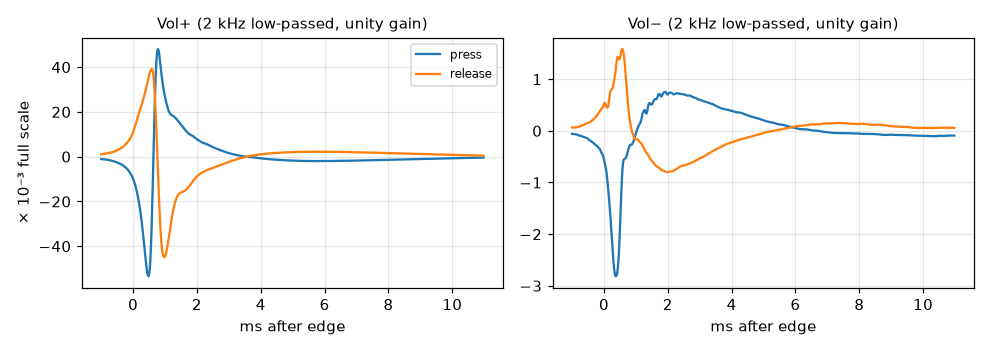

# applemote

Volume **+ / −** buttons of Apple's wired 3.5 mm EarPods remote on Linux laptops.

The centre (play/pause) button already works almost everywhere: it simply shorts
the mic line. The volume buttons don't. Apple's remote expects an identification
exchange over the mic bias, which Apple's own codecs (Cirrus Logic CS42L83/84)
do in hardware, and typical PC codecs such as Realtek's ALC2xx can't.

But even un-addressed, the remote disturbs the mic line on every volume press,
and each button leaves its own repeatable ~10 ms signature:



applemote listens for those signatures on the headset mic and turns them into
ordinary `KEY_VOLUMEUP` / `KEY_VOLUMEDOWN` presses, about 35 ms after you press.

## Status

| Machine | Codec / driver | Status |
|---|---|---|
| Lenovo Yoga 7 2-in-1 14IML9 (83DJ) | Realtek ALC287, SOF `sof-hda-dsp` | Works, templates included |
| Anything else with a jack-detected headset mic | any | Try it: `applemote calibrate`, then please report back |

## Install

Requirements: Linux with PipeWire (`pw-record`, `pactl`), `amixer`, Python ≥ 3.11
with NumPy and SciPy.

```sh
# Arch
sudo pacman -S --needed python-numpy python-scipy alsa-utils
# Debian / Ubuntu
sudo apt install python3-numpy python3-scipy alsa-utils pipewire-bin pulseaudio-utils
# Fedora
sudo dnf install python3-numpy python3-scipy alsa-utils pipewire-utils pulseaudio-utils
```

```sh
git clone https://github.com/RyanTheTide/applemote
cd applemote
make install                 # ~/.local + a udev rule (asks for sudo)
applemote setup              # finds your headset mic, writes ~/.config/applemote/config.ini
applemote calibrate          # only if setup says there are no templates for your machine
systemctl --user enable --now applemote
```

If `setup` warns that keys must go through `/dev/uinput` (common on desktops),
run `make install-uinput` too. Log out and back in once after either warning.

## Usage

It runs as a user service and needs no attention. Useful commands:

```sh
journalctl --user -u applemote -f       # one line per key, plus pause/resume
applemote run -v                        # foreground, with scores and near misses
applemote calibrate --save-wav rec.wav  # re-calibrate (e.g. a different headset)
```

## What it changes, and privacy

- **It listens to the headset mic** only while a headset with a mic is plugged in
  *and* no other app is using that mic. Audio is analysed in memory and never
  stored or sent anywhere. GNOME and KDE show the microphone indicator while it
  listens; that is expected.
- **It borrows the mic gain.** Detection needs an unclipped signal, so while
  listening the headset-mic gain is set to 0 dB. As soon as another app (a call,
  a recorder) opens the headset mic, your own gain is restored and detection
  pauses until that app is done. Saved gains survive crashes and are restored
  on the next start.
- **udev rule** (`/etc/udev/rules.d/70-applemote.rules`): lets your login session
  write key events into the sound card's jack input devices. Those devices can
  only emit the keys and switches they already have.
- **Power**: the audio path stays awake while it listens.

## Other machines and codecs

See [docs/porting.md](docs/porting.md) for how to check whether your codec
already sees the buttons, calibrate, read the results, and contribute templates.
It also covers how this was worked out on the ALC287.

## Uninstall

```sh
make uninstall
```

## Credits

- [aurora-silicon/linux#9](https://github.com/aurora-silicon/linux/pull/9), Apple
  headset remote support for the CS42L83/CS42L84 on Apple Silicon. It shows how
  Apple's own codecs identify the remote and decode its volume pulses.

## License

MIT
